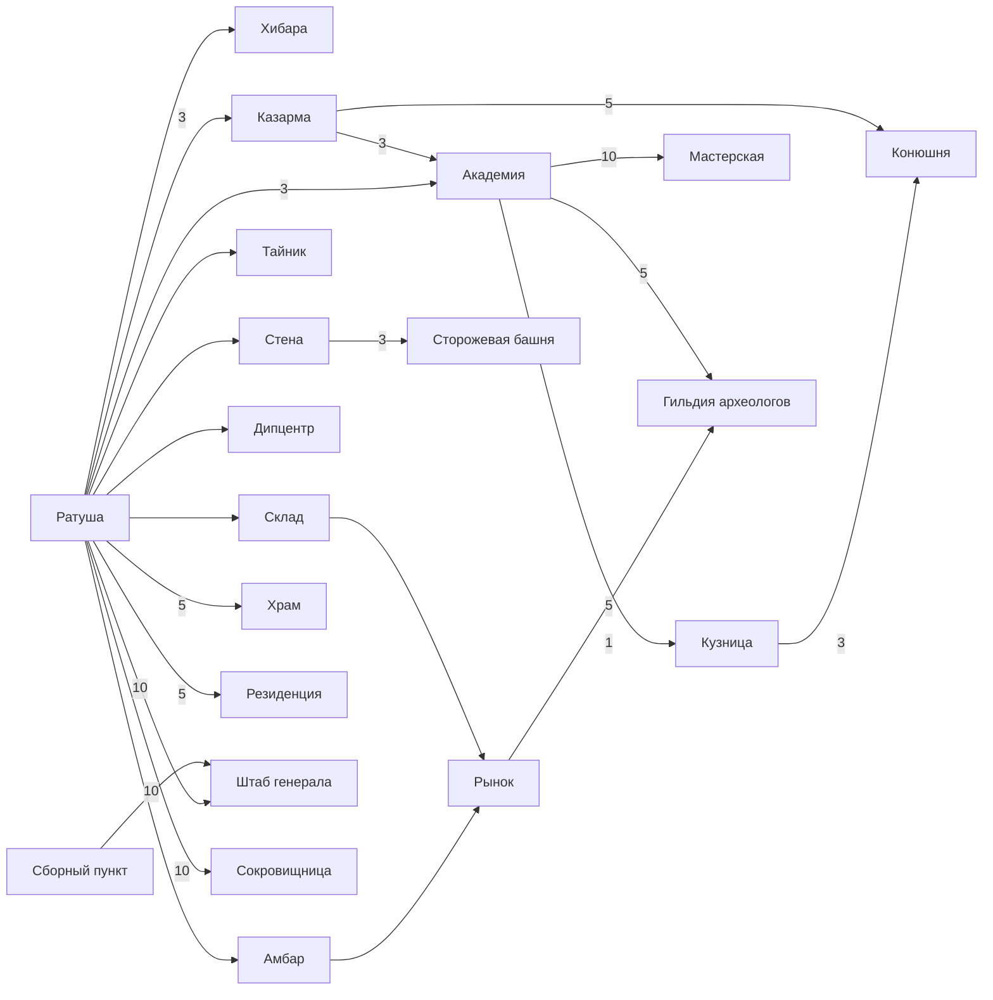

# 02. Геймдизайн (GDD) нашей игры

> Рабочее название: **«Война Королей»** (замените на своё).
> Основа — классическая браузерная стратегия о средневековых королевствах.
> Все числа — **наш баланс**; они лежат в [`data/buildings.json`](../data/buildings.json) и
> [`data/units.json`](../data/units.json) и генерируются скриптами из [`tools/`](../tools).
> Таблицы в этом документе между маркерами `GEN` пересобираются командой:
>
> ```bash
> python3 tools/gen_units.py && python3 tools/render_docs.py
> ```
>
> Пометки: ✅ — механика есть в оригинале; 🔶 — наше решение/реконструкция.

## Содержание

1. [Основные принципы](#1-основные-принципы)
2. [Мир и три слоя](#2-мир-и-три-слоя)
3. [Ресурсы, население, хранение](#3-ресурсы-население-хранение)
4. [Здания](#4-здания)
5. [Очереди строительства](#5-очереди-строительства)
6. [Расы и юниты](#6-расы-и-юниты)
7. [Наука и улучшения](#7-наука-и-улучшения)
8. [Передвижение армий и типы миссий](#8-передвижение-армий-и-типы-миссий)
9. [Боевая система](#9-боевая-система)
10. [Лояльность, праздники, бунты](#10-лояльность-праздники-бунты)
11. [Экспансия: новые и захваченные замки](#11-экспансия-новые-и-захваченные-замки)
12. [Генерал и оазисы](#12-генерал-и-оазисы)
13. [Археология и артефакты](#13-археология-и-артефакты)
14. [Торговля](#14-торговля)
15. [Альянсы и империи](#15-альянсы-и-империи)
16. [Профиль игрока](#16-профиль-игрока)
17. [Рейтинги и достижения](#17-рейтинги-и-достижения)
18. [Золото, премиум, наёмники](#18-золото-премиум-наёмники)
19. [Сообщения, отчёты, уведомления](#19-сообщения-отчёты-уведомления)
20. [Защита новичка, отпуск, правила](#20-защита-новичка-отпуск-правила)
21. [Обучение и задания](#21-обучение-и-задания)
22. [Объём MVP](#22-объём-mvp)

---

## 1. Основные принципы

- **Реальное время, асинхронность.** ✅ Всё (добыча, стройка, тренировка, марши) идёт на сервере, в том числе пока игрок оффлайн.
- **Сервер — единственный источник правды.** Клиент только показывает состояние и шлёт намерения («построить», «отправить войска»).
- **Параметры мира настраиваются**: скорость (x1, x3, x10), размер карты, длительность защиты новичка.
- **Никакой pay-to-win**: золото ускоряет удобство, но не даёт армию сильнее доступной бесплатно (кроме временных наёмников с жёстким лимитом).

## 2. Мир и три слоя

✅ У игрока три экрана-слоя:

```
┌───────────────────┐   ┌───────────────────┐   ┌───────────────────┐
│      ЗАМОК        │   │      ЗЕМЛИ        │   │       МИР         │
│ слоты под здания  │   │ 5x5 клеток вокруг │   │ карта 401x401     │
│ ратуша, склады,   │   │ лес/камни/железо/ │   │ замки, оазисы,    │
│ казармы, стена... │   │ трава + перераб.  │   │ руины, армии      │
└───────────────────┘   └───────────────────┘   └───────────────────┘
```

### 2.1 Замок
- 🔶 22 слота под здания + фиксированные места: Ратуша (центр), Стена (по периметру), Сборный пункт.
- Можно сносить здания (понижение на 1 уровень за раз, в Ратуше с 10 ур.).

### 2.2 Земли
- ✅ Сетка 5×5 вокруг замка, центр — сам замок, 24 клетки с типом местности: **лес → Лесопилка, камни → Каменоломня, железо → Рудник, трава → Ферма**.
- 🔶 Раскладка зависит от расы (смещена в сторону основного ресурса), см. `landsLayout` в `buildings.json`.
- Перерабатывающие здания (Мельница, Столярная, Каменотёс, Плавильня) ставятся на любую свободную клетку вместо добывающего здания — это выбор игрока.

### 2.3 Мир
- 🔶 Карта с координатами `x, y ∈ [-200; 200]`, без «заворачивания» краёв.
- Типы клеток: пусто (можно основать замок), замок игрока, **оазис** (4 типа), **руины** (место раскопок), NPC-лагеря (бандиты для фарма новичков).
- Расстояние — евклидово: `d = √((x1−x2)² + (y1−y2)²)`; время марша = `d / speed` часов (speed — самого медленного юнита отряда) × множитель скорости мира.
- Новые игроки появляются в секторе по выбору (СЗ/СВ/ЮЗ/ЮВ) на кольце, расширяющемся от центра по мере заполнения.

## 3. Ресурсы, население, хранение

| Ресурс | Где добывается | Где хранится | Главный для расы |
|---|---|---|---|
| Еда | Ферма (трава) | Амбар | Орки ✅ (+ содержание армии) |
| Дерево | Лесопилка (лес) | Склад | Эльфы ✅ |
| Камень | Каменоломня (камни) | Склад | Гномы ✅ |
| Железо | Рудник (железо) | Склад | Люди ✅ |
| Золото | покупка / аукцион / задания | аккаунт | премиум-валюта |

### 3.1 Производство (ленивый расчёт)

Ресурсы **не тикают** на сервере каждую секунду. В замке хранится снимок `amount` и время `updated_at`; текущее значение считается при чтении:

```
rate[r]   = Σ PROD_TABLE[level клетки] × (1 + бонус_переработки + бонус_оазисов + бонус_артефактов)
          − (r == food ? содержание_армии + население_зданий : 0)
amount[r] = clamp(amount_snapshot[r] + rate[r] × (now − updated_at)/3600, 0, capacity[r])
```

Снимок переписывается при любом изменении (стройка, трата, приход грабежа, изменение rate).

### 3.2 Голод
Если `rate[food] < 0` и еда кончается, сервер планирует событие «голод»: гибнут юниты с наибольшим содержанием (сначала чужие подкрепления, затем свои), пока баланс не станет ≥ 0. Лояльность −5 за каждый час голода.

### 3.3 Население
- ✅ Живёт в Хибарах. Каждое здание занимает `populationPerLevel × level`, каждый юнит — `population`.
- Нельзя начать стройку/тренировку, если свободного населения не хватает.
- Население — главный показатель «размера» игрока в рейтинге.

### 3.4 Хранение и тайник

Без склада/амбара замок хранит по 800 каждого ресурса. Несколько складов/амбаров суммируются. Вместимость уровня L = `round100(1000 × 1.22^L)`.

<!-- GEN:storage -->
| Ур. | Добыча клетки, ед/час | Вместимость склада/амбара | Спрятано в тайнике (гномы ×2) |
|---|---|---|---|
| 0 | 3 | — | — |
| 1 | 7 | 1200 | 200 |
| 2 | 13 | 1500 | 260 |
| 3 | 21 | 1800 | 338 |
| 4 | 31 | 2200 | 439 |
| 5 | 46 | 2700 | 571 |
| 6 | 70 | 3300 | 742 |
| 7 | 98 | 4000 | 965 |
| 8 | 140 | 4900 | 1254 |
| 9 | 203 | 6000 | 1631 |
| 10 | 280 | 7300 | 2120 |
| 11 | 392 | 8900 | — |
| 12 | 525 | 10900 | — |
| 13 | 693 | 13300 | — |
| 14 | 889 | 16200 | — |
| 15 | 1120 | 19700 | — |
| 16 | — | 24100 | — |
| 17 | — | 29400 | — |
| 18 | — | 35800 | — |
| 19 | — | 43700 | — |
| 20 | — | 53400 | — |
<!-- /GEN:storage -->

## 4. Здания

### 4.1 Каталог

<!-- GEN:buildings -->
| Здание | Слой | Макс. ур. | Несколько? | Требования | Что даёт | Оригинал |
|---|---|---|---|---|---|---|
| **Ратуша** `townhall` | Замок | 20 | нет | — | Сердце замка. Уровень ускоряет строительство и открывает остальные здания. Найм наёмников.<br>`buildTimeMultiplier`: 0.964^level; `mercenaries`: найм наёмников с 5 ур. | ✅ |
| **Хибара** `hut` | Замок | 20 | да | Ратуша 1 | Жильё населения. Население нужно для строек и армии; каждая новая хибара — только после 10 ур. предыдущей.<br>`populationCap`: 20 * 1.18^level | ✅ |
| **Склад** `warehouse` | Замок | 20 | да | Ратуша 1 | Хранит дерево, камень и железо. Излишки сверх вместимости теряются.<br>`capacity`: round100(1000 * 1.22^level) дерева/камня/железа | ✅ |
| **Амбар** `granary` | Замок | 20 | да | Ратуша 1 | Хранит еду. Критично для орков.<br>`capacity`: round100(1000 * 1.22^level) еды | 🔶 |
| **Тайник** `cache` | Замок | 10 | да | Ратуша 1 | Прячет часть ресурсов от грабителей.<br>`hidden`: 200 * 1.3^(level-1) каждого ресурса; гномы x2; несколько тайников суммируются | ✅ |
| **Стена** `wall` | Замок | 20 | нет | Ратуша 1 | Бонус к защите замка и всех войск в нём. Разрушается таранами.<br>`defenseBonus`: 1 + perLevel*level; perLevel: люди 0.030, эльфы 0.035, гномы 0.020, орки 0.025; `fixedDefense`: 10 * level | ✅ |
| **Казарма** `barracks` | Замок | 20 | нет | Ратуша 3 | Тренировка пехоты.<br>`trainTimeMultiplier`: 0.9^(level-1); `trains`: infantry | ✅ |
| **Кузница** `smithy` | Замок | 20 | нет | Ратуша 3, Академия 1 | Улучшение оружия и брони; открывает часть войск.<br>`unitUpgrade`: каждый тип юнита улучшается до уровня кузницы: атака и защита x1.015^upgrade | ✅ |
| **Конюшня** `stable` | Замок | 20 | нет | Казарма 5, Кузница 3 | Тренировка кавалерии и разведчиков.<br>`trainTimeMultiplier`: 0.9^(level-1); `trains`: cavalry | ✅ |
| **Мастерская** `workshop` | Замок | 20 | нет | Ратуша 5, Академия 10 | Постройка таранов и катапульт.<br>`trainTimeMultiplier`: 0.9^(level-1); `trains`: siege | 🔶 |
| **Академия** `academy` | Замок | 20 | нет | Ратуша 3, Казарма 3 | Наука: исследование юнитов и технологий, тренировка магов.<br>`research`: исследование новых юнитов и технологий ("развитие науки"); `trains`: magic | 🔶 |
| **Храм** `temple` | Замок | 10 | да | Ратуша 5 | Повышает лояльность населения, позволяет проводить праздники. Легендарные юниты призываются здесь.<br>`loyaltyPerHour`: +0.5 * level; `festival`: малый праздник с 1 ур., большой — с 10 ур. | ✅ |
| **Резиденция** `residence` | Замок | 20 | нет | Ратуша 5 | Центр управления: показывает лояльность, даёт слоты экспансии, тренирует поселенцев и бунтарей. Если разрушена — замок проще захватить.<br>`loyaltyMax`: 100; `loyaltyRegen`: +level %/час; `expansionSlots`: 1 слот на 10 и 20 ур. (поселенцы/бунтари) | ✅ |
| **Рынок** `market` | Замок | 20 | нет | Ратуша 3, Склад 1, Амбар 1 | Торговые предложения, обмен с NPC-купцом, торговцы-караваны.<br>`merchantsCap`: level; `trains`: merchant | 🔶 |
| **Дипломатический центр** `embassy` | Замок | 20 | нет | Ратуша 1 | Вступление в альянс, создание альянса; уровень = слоты участников и новые возможности.<br>`joinAlliance`: с 1 ур.; `createAlliance`: с 3 ур.; `allianceSlots`: 3 * level участников у создателя; `createEmpire`: с 15 ур. | ✅ |
| **Сборный пункт** `rally_point` | Замок | 20 | нет | — | Отправка войск, просмотр входящих/исходящих армий.<br>`sendTroops`: с 1 ур.; `catapultTargeting`: выбор цели катапульт с 10 ур. | 🔶 |
| **Сторожевая башня** `watchtower` | Замок | 10 | нет | Стена 3 | Контрразведка и раннее оповещение.<br>`counterScout`: свои разведчики защищают от вражеских x(1+0.05*level); `incomingInfo`: с 5 ур. видно тип войск во входящей атаке | 🔶 |
| **Штаб генерала** `general_hq` | Замок | 20 | нет | Ратуша 10, Сборный пункт 10 | Найм и прокачка генерала (один на замок). Нужен для захвата оазисов.<br>`trains`: general; `generalLevelCap`: level | 🔶 |
| **Гильдия археологов** `archaeology` | Замок | 10 | нет | Академия 5, Рынок 5 | Археологические экспедиции за артефактами.<br>`trains`: archaeologist; `expeditionsParallel`: 1 + floor(level/4); `findChance`: +3% за уровень | 🔶 |
| **Сокровищница** `treasury` | Замок | 20 | нет | Ратуша 10 | Хранение и активация артефактов.<br>`artifactSlots`: малый артефакт с 1 ур., большой с 10 ур., уникальный с 20 ур. | 🔶 |
| **Ферма** `farm` | Земли (трава) | 10 (столица 15) | да | — | Добыча еды. Строится на клетке травы.<br>`production`: PROD_TABLE[level] еды/час | ✅ |
| **Лесопилка** `sawmill` | Земли (лес) | 10 (столица 15) | да | — | Добыча дерева. Строится на клетке леса.<br>`production`: PROD_TABLE[level] дерева/час | ✅ |
| **Каменоломня** `quarry` | Земли (камни) | 10 (столица 15) | да | — | Добыча камня. Строится на клетке камней.<br>`production`: PROD_TABLE[level] камня/час | ✅ |
| **Рудник (сталелитейня)** `mine` | Земли (железо) | 10 (столица 15) | да | — | Добыча железа. Строится на клетке железа.<br>`production`: PROD_TABLE[level] железа/час | ✅ |
| **Мельница** `mill` | Земли (любая) | 5 | нет | Ферма 10, Ратуша 5 | Переработка: бонус к добыче еды.<br>`bonus`: +5% еды за уровень | 🔶 |
| **Столярная** `carpentry` | Земли (любая) | 5 | нет | Лесопилка 10, Ратуша 5 | Переработка: бонус к добыче дерева.<br>`bonus`: +5% дерева за уровень | 🔶 |
| **Каменотёс** `stonemason` | Земли (любая) | 5 | нет | Каменоломня 10, Ратуша 5 | Переработка: бонус к добыче камня.<br>`bonus`: +5% камня за уровень | 🔶 |
| **Плавильня** `smelter` | Земли (любая) | 5 | нет | Рудник (сталелитейня) 10, Ратуша 5 | Переработка: бонус к добыче железа.<br>`bonus`: +5% железа за уровень | 🔶 |
| **Древо жизни** `grove_of_life` | Замок, только Эльфы | 10 | нет | Храм 5 | Расовое здание эльфов.<br>`defenderRecovery`: после обороны возвращается 2%*level погибших защитников | 🔶 |
| **Глубинная кузня** `deep_forge` | Замок, только Гномы | 10 | нет | Кузница 10 | Расовое здание гномов.<br>`siegeBonus`: +3%*level атаки таранов и катапульт | 🔶 |
| **Тотем войны** `war_totem` | Замок, только Орки | 10 | нет | Казарма 10 | Расовое здание орков.<br>`raidBonus`: +2%*level к грузоподъёмности и атаке при грабеже | 🔶 |
| **Гильдия мастеров** `guild_hall` | Замок, только Люди | 10 | нет | Академия 10 | Расовое здание людей.<br>`researchSpeed`: -3%*level времени исследований и улучшений | 🔶 |
<!-- /GEN:buildings -->

### 4.2 Дерево зависимостей



### 4.3 Стоимость и время по уровням

Формулы (из `buildings.json`):

```
cost(level)  = round5(baseCost × costGrowth^(level−1))
time(level)  = baseTimeSec × timeGrowth^(level−1) × 0.964^уровень_Ратуши   (÷ скорость мира)
```

<!-- GEN:levels -->
**Ратуша** (рост стоимости ×1.28, времени ×1.18 за уровень)

| Ур. | Еда | Дерево | Камень | Железо | Время (Ратуша 0) | Время (Ратуша 10) |
|---|---|---|---|---|---|---|
| 1 | 70 | 70 | 70 | 40 | 0:05:00 | 0:03:27 |
| 2 | 90 | 90 | 90 | 50 | 0:05:54 | 0:04:05 |
| 3 | 115 | 115 | 115 | 65 | 0:06:57 | 0:04:49 |
| 5 | 190 | 190 | 190 | 105 | 0:09:41 | 0:06:43 |
| 10 | 645 | 645 | 645 | 370 | 0:22:10 | 0:15:22 |
| 15 | 2220 | 2220 | 2220 | 1270 | 0:50:44 | 0:35:09 |
| 20 | 7620 | 7620 | 7620 | 4355 | 1:56:04 | 1:20:26 |

**Склад** (рост стоимости ×1.28, времени ×1.16 за уровень)

| Ур. | Еда | Дерево | Камень | Железо | Время (Ратуша 0) | Время (Ратуша 10) |
|---|---|---|---|---|---|---|
| 1 | 60 | 100 | 80 | 40 | 0:04:00 | 0:02:46 |
| 2 | 75 | 130 | 100 | 50 | 0:04:38 | 0:03:12 |
| 3 | 100 | 165 | 130 | 65 | 0:05:22 | 0:03:43 |
| 5 | 160 | 270 | 215 | 105 | 0:07:14 | 0:05:01 |
| 10 | 555 | 920 | 740 | 370 | 0:15:12 | 0:10:32 |
| 15 | 1900 | 3170 | 2535 | 1270 | 0:31:57 | 0:22:08 |
| 20 | 6535 | 10890 | 8710 | 4355 | 1:07:06 | 0:46:30 |

**Казарма** (рост стоимости ×1.28, времени ×1.18 за уровень)

| Ур. | Еда | Дерево | Камень | Железо | Время (Ратуша 0) | Время (Ратуша 10) |
|---|---|---|---|---|---|---|
| 1 | 210 | 140 | 260 | 120 | 0:15:00 | 0:10:23 |
| 2 | 270 | 180 | 335 | 155 | 0:17:42 | 0:12:16 |
| 3 | 345 | 230 | 425 | 195 | 0:20:53 | 0:14:28 |
| 5 | 565 | 375 | 700 | 320 | 0:29:04 | 0:20:09 |
| 10 | 1935 | 1290 | 2400 | 1105 | 1:06:31 | 0:46:06 |
| 15 | 6655 | 4435 | 8240 | 3805 | 2:32:12 | 1:45:29 |
| 20 | 22865 | 15245 | 28310 | 13065 | 5:48:12 | 4:01:20 |

**Стена** (рост стоимости ×1.28, времени ×1.18 за уровень)

| Ур. | Еда | Дерево | Камень | Железо | Время (Ратуша 0) | Время (Ратуша 10) |
|---|---|---|---|---|---|---|
| 1 | 70 | 90 | 170 | 70 | 0:10:00 | 0:06:55 |
| 2 | 90 | 115 | 220 | 90 | 0:11:48 | 0:08:10 |
| 3 | 115 | 145 | 280 | 115 | 0:13:55 | 0:09:39 |
| 5 | 190 | 240 | 455 | 190 | 0:19:23 | 0:13:26 |
| 10 | 645 | 830 | 1570 | 645 | 0:44:21 | 0:30:44 |
| 15 | 2220 | 2850 | 5390 | 2220 | 1:41:28 | 1:10:19 |
| 20 | 7620 | 9800 | 18510 | 7620 | 3:52:08 | 2:40:53 |

**Лесопилка** (рост стоимости ×1.5, времени ×1.45 за уровень)

| Ур. | Еда | Дерево | Камень | Железо | Время (Ратуша 0) | Время (Ратуша 10) |
|---|---|---|---|---|---|---|
| 1 | 40 | 100 | 50 | 60 | 0:02:40 | 0:01:50 |
| 2 | 60 | 150 | 75 | 90 | 0:03:52 | 0:02:40 |
| 3 | 90 | 225 | 110 | 135 | 0:05:36 | 0:03:53 |
| 5 | 200 | 505 | 255 | 305 | 0:11:47 | 0:08:10 |
| 10 | 1540 | 3845 | 1920 | 2305 | 1:15:33 | 0:52:21 |
| 15 | 11675 | 29195 | 14595 | 17515 | 8:04:18 | 5:35:39 |
<!-- /GEN:levels -->

## 5. Очереди строительства

- ✅ Одновременно **3 стройки** в замке (с премиумом — **5**).
- 🔶 Отдельно считаются: максимум 2 стройки в слое «Замок» и 2 в «Землях» (без премиума), чтобы не было перекоса.
- Ресурсы списываются при постановке в очередь. Отмена: возврат 100% в первые 60 секунд, дальше — 80%.
- Ускорение: мгновенно достроить за золото (цена ∝ оставшемуся времени), только для зданий ниже 15 уровня.
- Тренировка войск — отдельные очереди по каждому зданию (Казарма, Конюшня, Мастерская, Академия, Резиденция…), юниты выходят по одному; время на юнита = `trainTimeSec × 0.9^(уровень_здания−1)`.

## 6. Расы и юниты

### 6.1 Расы

| Раса | Атака | Защита | Магия | Скорость | Стоимость / время | Особенность |
|---|---|---|---|---|---|---|
| Люди | ×1.00 | ×1.00 | ×1.00 | ×1.00 | время ×0.85 | Гильдия мастеров (быстрее наука), стена +3%/ур |
| Эльфы | ×0.80 | ×1.30 | ×1.20 | ×1.05 | — | Древо жизни (возврат погибших защитников), стена +3.5%/ур |
| Гномы | ×1.25 | ×0.85 | ×0.80 | ×0.90 | — | Тайники ×2, Глубинная кузня (осада), стена +2%/ур |
| Орки | ×2.50 | ×0.90 | ×1.00 | ×1.00 | стоимость ×1.8, время ×1.4, еда ×2 | Тотем войны (грабёж), стена +2.5%/ур |

Раса выбирается один раз при регистрации (смена — за золото, только пока в аккаунте один замок и нет армии).

### 6.2 Роли (одинаковый «скелет» у всех рас)

| Роль | Тип | Назначение |
|---|---|---|
| Базовый защитник | пехота | Дешёвая оборона |
| Базовый атакующий | пехота | Дешёвый грабёж/атака |
| Стрелок | пехота | Оборона против пехоты |
| Элитная пехота | пехота | Универсальный боец |
| Разведчик | кавалерия | ✅ Разведка, контрразведка |
| Лёгкая кавалерия | кавалерия | Быстрый грабёж, большой груз |
| Тяжёлая кавалерия | кавалерия | Ударная сила |
| Маг | магия | ✅ Магическая атака (игнорирует стену) |
| Таран | осада | ✅ Ломает стену |
| Катапульта | осада | ✅ Ломает здания |
| Торговец | спец. | ✅ Возит ресурсы |
| Поселенец | спец. | Основывает новый замок |
| Бунтарь | спец. | ✅ Снижает лояльность → захват замка |
| Археолог | спец. | ✅ Экспедиции за артефактами |
| Генерал | спец. | ✅ Командир, захват оазисов (1 на замок) |
| Легендарный | магия | ✅ Призывается артефактом |

### 6.3 Таблицы юнитов

Скорость — клеток карты в час; «Нас» — занимаемое население; время — при 1 ур. здания и скорости мира x1. ✅ — название юнита подтверждено в оригинале.

<!-- GEN:units -->
#### Люди — основной ресурс: iron; Баланс; тренируются на 15% быстрее («учатся быстро»)

| Юнит | Роль | Атк | Маг | Защ пех/кав/маг | Скор | Груз | Еда/ч | Нас | Еда | Дер | Кам | Жел | Время | Здание |
|---|---|---|---|---|---|---|---|---|---|---|---|---|---|---|
| Ополченец | Базовый защитник | 20 | 0 | 45/40/15 | 6.0 | 30 | 1 | 1 | 70 | 70 | 70 | 145 | 0:08:30 | barracks |
| Мечник | Базовый атакующий | 50 | 0 | 25/15/10 | 6.0 | 50 | 1 | 1 | 80 | 80 | 80 | 160 | 0:09:55 | barracks |
| Арбалетчик | Стрелок | 35 | 0 | 50/25/20 | 5.0 | 25 | 1 | 1 | 85 | 85 | 85 | 170 | 0:11:20 | barracks |
| Паладин | Элитная пехота | 70 | 0 | 40/60/25 | 5.0 | 40 | 1 | 1 | 140 | 140 | 140 | 280 | 0:18:25 | barracks |
| Разведчик | Разведчик | 0 | 0 | 10/5/5 | 16.0 | 0 | 1 | 2 | 60 | 60 | 60 | 120 | 0:08:30 | stable |
| Всадник | Лёгкая кавалерия | 90 | 0 | 20/30/10 | 14.0 | 90 | 2 | 2 | 180 | 180 | 180 | 360 | 0:21:15 | stable |
| Рыцарь | Тяжёлая кавалерия | 130 | 0 | 70/50/30 | 10.0 | 60 | 3 | 3 | 300 | 300 | 300 | 600 | 0:34:00 | stable |
| Боевой маг | Маг | 10 | 90 | 20/20/60 | 5.0 | 0 | 2 | 2 | 260 | 260 | 260 | 520 | 0:28:20 | academy |
| Таран | Таран (стены) | 60 | 0 | 30/75/10 | 4.0 | 0 | 3 | 3 | 220 | 220 | 220 | 440 | 0:42:30 | workshop |
| Катапульта | Катапульта (здания) | 75 | 0 | 60/10/10 | 3.0 | 0 | 6 | 4 | 360 | 360 | 360 | 720 | 1:10:50 | workshop |
| Торговец | Торговец (караван) | 0 | 0 | 5/5/5 | 12.0 | 500 | 1 | 1 | 80 | 80 | 80 | 160 | 0:17:00 | market |
| Поселенец | Поселенец (новый замок) | 0 | 0 | 80/80/80 | 5.0 | 3000 | 1 | 1 | 1000 | 1000 | 1000 | 2000 | 2:07:30 | residence |
| Бунтарь ✅ | Бунтарь (лояльность) | 40 | 0 | 30/25/20 | 4.0 | 0 | 5 | 5 | 600 | 600 | 600 | 1200 | 1:39:10 | residence |
| Археолог | Археолог (экспедиции) | 0 | 0 | 10/10/10 | 5.0 | 0 | 1 | 1 | 240 | 240 | 240 | 480 | 0:51:00 | archaeology |
| Генерал ✅ | Генерал (оазисы, командование) | 100 | 20 | 100/100/60 | 7.0 | 0 | 6 | 6 | 1200 | 1200 | 1200 | 2400 | 3:24:00 | general_hq |
| Грифон-страж | Легендарный (нужен артефакт) | 250 | 50 | 150/150/100 | 7.0 | 100 | 6 | 6 | 1200 | 1200 | 1200 | 2400 | 2:33:00 | temple |

#### Эльфы — основной ресурс: wood; Сильная защита и магия, слабая атака

| Юнит | Роль | Атк | Маг | Защ пех/кав/маг | Скор | Груз | Еда/ч | Нас | Еда | Дер | Кам | Жел | Время | Здание |
|---|---|---|---|---|---|---|---|---|---|---|---|---|---|---|
| Страж рощи | Базовый защитник | 16 | 0 | 58/52/20 | 6.3 | 30 | 1 | 1 | 70 | 145 | 70 | 70 | 0:10:00 | barracks |
| Танцующий с клинками ✅ | Базовый атакующий | 40 | 0 | 32/20/13 | 6.3 | 50 | 1 | 1 | 80 | 160 | 80 | 80 | 0:11:40 | barracks |
| Эльф-лучник ✅ | Стрелок | 28 | 0 | 65/32/26 | 5.2 | 25 | 1 | 1 | 85 | 170 | 85 | 85 | 0:13:20 | barracks |
| Зверь ✅ | Элитная пехота | 56 | 0 | 52/78/32 | 5.2 | 40 | 1 | 1 | 140 | 280 | 140 | 140 | 0:21:40 | barracks |
| Разведчик ✅ | Разведчик | 0 | 0 | 13/6/6 | 16.8 | 0 | 1 | 2 | 60 | 120 | 60 | 60 | 0:10:00 | stable |
| Кентавр ✅ | Лёгкая кавалерия | 72 | 0 | 26/39/13 | 14.7 | 90 | 2 | 2 | 180 | 360 | 180 | 180 | 0:25:00 | stable |
| Единорог ✅ | Тяжёлая кавалерия | 104 | 0 | 91/65/39 | 10.5 | 60 | 3 | 3 | 300 | 600 | 300 | 300 | 0:40:00 | stable |
| Друид | Маг | 8 | 108 | 26/26/78 | 5.2 | 0 | 2 | 2 | 260 | 520 | 260 | 260 | 0:33:20 | academy |
| Древень ✅ | Таран (стены) | 48 | 0 | 39/98/13 | 4.2 | 0 | 3 | 3 | 220 | 440 | 220 | 220 | 0:50:00 | workshop |
| Метатель лоз | Катапульта (здания) | 60 | 0 | 78/13/13 | 3.2 | 0 | 6 | 4 | 360 | 720 | 360 | 360 | 1:23:20 | workshop |
| Путешественник ✅ | Торговец (караван) | 0 | 0 | 5/5/5 | 12.6 | 500 | 1 | 1 | 80 | 160 | 80 | 80 | 0:20:00 | market |
| Создатель ✅ | Поселенец (новый замок) | 0 | 0 | 80/80/80 | 5.2 | 3000 | 1 | 1 | 1000 | 2000 | 1000 | 1000 | 2:30:00 | residence |
| Бунтарь ✅ | Бунтарь (лояльность) | 32 | 0 | 39/32/26 | 4.2 | 0 | 5 | 5 | 600 | 1200 | 600 | 600 | 1:56:40 | residence |
| Учёный ✅ | Археолог (экспедиции) | 0 | 0 | 10/10/10 | 5.2 | 0 | 1 | 1 | 240 | 480 | 240 | 240 | 1:00:00 | archaeology |
| Генерал ✅ | Генерал (оазисы, командование) | 80 | 24 | 130/130/78 | 7.4 | 0 | 6 | 6 | 1200 | 2400 | 1200 | 1200 | 4:00:00 | general_hq |
| Химера ✅ | Легендарный (нужен артефакт) | 200 | 60 | 195/195/130 | 7.4 | 100 | 6 | 6 | 1200 | 2400 | 1200 | 1200 | 3:00:00 | temple |

#### Гномы — основной ресурс: stone; Сильная атака, слабая защита, средняя скорость; тайники x2

| Юнит | Роль | Атк | Маг | Защ пех/кав/маг | Скор | Груз | Еда/ч | Нас | Еда | Дер | Кам | Жел | Время | Здание |
|---|---|---|---|---|---|---|---|---|---|---|---|---|---|---|
| Защитник гор ✅ | Базовый защитник | 25 | 0 | 38/34/13 | 5.4 | 30 | 1 | 1 | 70 | 70 | 145 | 70 | 0:10:00 | barracks |
| Топорщик | Базовый атакующий | 62 | 0 | 21/13/8 | 5.4 | 50 | 1 | 1 | 80 | 80 | 160 | 80 | 0:11:40 | barracks |
| Гном-арбалетчик | Стрелок | 44 | 0 | 42/21/17 | 4.5 | 25 | 1 | 1 | 85 | 85 | 170 | 85 | 0:13:20 | barracks |
| Берсерк | Элитная пехота | 88 | 0 | 34/51/21 | 4.5 | 40 | 1 | 1 | 140 | 140 | 280 | 140 | 0:21:40 | barracks |
| Лазутчик | Разведчик | 0 | 0 | 8/4/4 | 14.4 | 0 | 1 | 2 | 60 | 60 | 120 | 60 | 0:10:00 | stable |
| Наездник на вепре | Лёгкая кавалерия | 112 | 0 | 17/26/8 | 12.6 | 90 | 2 | 2 | 180 | 180 | 360 | 180 | 0:25:00 | stable |
| Бронированный вепрь | Тяжёлая кавалерия | 162 | 0 | 60/42/26 | 9.0 | 60 | 3 | 3 | 300 | 300 | 600 | 300 | 0:40:00 | stable |
| Рунный жрец | Маг | 12 | 72 | 17/17/51 | 4.5 | 0 | 2 | 2 | 260 | 260 | 520 | 260 | 0:33:20 | academy |
| Бур | Таран (стены) | 75 | 0 | 26/64/8 | 3.6 | 0 | 3 | 3 | 220 | 220 | 440 | 220 | 0:50:00 | workshop |
| Паровая баллиста | Катапульта (здания) | 94 | 0 | 51/8/8 | 2.7 | 0 | 6 | 4 | 360 | 360 | 720 | 360 | 1:23:20 | workshop |
| Караванщик | Торговец (караван) | 0 | 0 | 5/5/5 | 10.8 | 500 | 1 | 1 | 80 | 80 | 160 | 80 | 0:20:00 | market |
| Переселенец | Поселенец (новый замок) | 0 | 0 | 80/80/80 | 4.5 | 3000 | 1 | 1 | 1000 | 1000 | 2000 | 1000 | 2:30:00 | residence |
| Бунтарь ✅ | Бунтарь (лояльность) | 50 | 0 | 26/21/17 | 3.6 | 0 | 5 | 5 | 600 | 600 | 1200 | 600 | 1:56:40 | residence |
| Рудознатец | Археолог (экспедиции) | 0 | 0 | 10/10/10 | 4.5 | 0 | 1 | 1 | 240 | 240 | 480 | 240 | 1:00:00 | archaeology |
| Генерал ✅ | Генерал (оазисы, командование) | 125 | 16 | 85/85/51 | 6.3 | 0 | 6 | 6 | 1200 | 1200 | 2400 | 1200 | 4:00:00 | general_hq |
| Железный голем | Легендарный (нужен артефакт) | 312 | 40 | 128/128/85 | 6.3 | 100 | 6 | 6 | 1200 | 1200 | 2400 | 1200 | 3:00:00 | temple |

#### Орки — основной ресурс: food; Атака в 2 раза выше гномьей, но юниты дорогие и «немногочисленные»; много еды на содержание

| Юнит | Роль | Атк | Маг | Защ пех/кав/маг | Скор | Груз | Еда/ч | Нас | Еда | Дер | Кам | Жел | Время | Здание |
|---|---|---|---|---|---|---|---|---|---|---|---|---|---|---|
| Гоблин-страж | Базовый защитник | 50 | 0 | 40/36/14 | 6.0 | 30 | 2 | 2 | 290 | 120 | 120 | 120 | 0:14:00 | barracks |
| Мародёр ✅ | Базовый атакующий | 125 | 0 | 22/14/9 | 6.0 | 50 | 2 | 2 | 325 | 130 | 130 | 130 | 0:16:19 | barracks |
| Метатель копий | Стрелок | 88 | 0 | 45/22/18 | 5.0 | 25 | 2 | 2 | 340 | 140 | 140 | 140 | 0:18:40 | barracks |
| Тролль | Элитная пехота | 175 | 0 | 36/54/22 | 5.0 | 40 | 2 | 2 | 565 | 230 | 230 | 230 | 0:30:19 | barracks |
| Следопыт | Разведчик | 0 | 0 | 9/4/4 | 16.0 | 0 | 2 | 3 | 245 | 100 | 100 | 100 | 0:14:00 | stable |
| Волчий всадник | Лёгкая кавалерия | 225 | 0 | 18/27/9 | 14.0 | 90 | 4 | 3 | 730 | 295 | 295 | 295 | 0:35:00 | stable |
| Всадник на ящере | Тяжёлая кавалерия | 325 | 0 | 63/45/27 | 10.0 | 60 | 6 | 5 | 1215 | 495 | 495 | 495 | 0:56:00 | stable |
| Шаман | Маг | 25 | 90 | 18/18/54 | 5.0 | 0 | 4 | 3 | 1055 | 430 | 430 | 430 | 0:46:40 | academy |
| Таран-бивень | Таран (стены) | 150 | 0 | 27/68/9 | 4.0 | 0 | 6 | 5 | 890 | 365 | 365 | 365 | 1:10:00 | workshop |
| Камнемёт | Катапульта (здания) | 188 | 0 | 54/9/9 | 3.0 | 0 | 12 | 6 | 1460 | 595 | 595 | 595 | 1:56:40 | workshop |
| Гоблин-торговец | Торговец (караван) | 0 | 0 | 5/5/5 | 12.0 | 500 | 2 | 2 | 325 | 130 | 130 | 130 | 0:28:00 | market |
| Вождь клана | Поселенец (новый замок) | 0 | 0 | 80/80/80 | 5.0 | 3000 | 2 | 2 | 4050 | 1650 | 1650 | 1650 | 3:30:00 | residence |
| Бунтарь ✅ | Бунтарь (лояльность) | 100 | 0 | 27/22/18 | 4.0 | 0 | 10 | 8 | 2430 | 990 | 990 | 990 | 2:43:20 | residence |
| Грабитель могил | Археолог (экспедиции) | 0 | 0 | 10/10/10 | 5.0 | 0 | 2 | 2 | 970 | 395 | 395 | 395 | 1:24:00 | archaeology |
| Генерал ✅ | Генерал (оазисы, командование) | 250 | 20 | 90/90/54 | 7.0 | 0 | 12 | 9 | 4860 | 1980 | 1980 | 1980 | 5:36:00 | general_hq |
| Демон бездны | Легендарный (нужен артефакт) | 625 | 50 | 135/135/90 | 7.0 | 100 | 12 | 9 | 4860 | 1980 | 1980 | 1980 | 4:11:59 | temple |
<!-- /GEN:units -->

## 7. Наука и улучшения

- ✅ «Развитие науки». Юниты, кроме базового защитника, нужно **исследовать в Академии** один раз на замок: стоимость = 3 × цена юнита, время = 4 × время тренировки.
- **Кузница**: улучшение каждого типа юнита до уровня кузницы (макс. 20). Каждый уровень: атака и защита ×1.015. Стоимость улучшения `n` = цена юнита × 2 × 1.2^n.
- **Технологии Академии** (глобальные для замка, 🔶): «Дороги» (+5% скорости/ур., 5 ур.), «Логистика» (+10% груза/ур., 5 ур.), «Картография» (дальность раскопок), «Военное дело» (−3% времени тренировки/ур.).

## 8. Передвижение армий и типы миссий

Армия отправляется из Сборного пункта. Скорость отряда = скорость самого медленного юнита (генерал подстраивается).

| Миссия | Кто | Что происходит |
|---|---|---|
| **Разведка** | только разведчики | Бой разведчиков; выжившие приносят отчёт: ресурсы и войска (с 3 ур. Академии) + здания/стена (с 10 ур.) |
| **Набег (грабёж)** | любые | Бой «до отступления» (частичные потери), вынос ресурсов |
| **Атака** | любые | Бой до конца; тараны ломают стену, катапульты — здания; бунтари снижают лояльность |
| **Подкрепление** | любые | Войска встают в чужой/свой замок; содержание платит владелец войск |
| **Основание замка** | поселенец | На пустой клетке появляется новый замок (если есть слот экспансии) |
| **Захват оазиса** | армия + генерал | После победы оазис переходит к замку |
| **Экспедиция** | археологи | Раскопки в руинах, шанс найти артефакт |
| **Торговый караван** | торговцы | Доставка ресурсов (см. «Торговля») |
| **Возврат** | — | Автоматически после любой миссии, с добычей |

- Отменить марш можно в первые 90 секунд (армия разворачивается).
- Защищающийся видит **входящую атаку** (время прибытия всегда; состав — со Сторожевой башней 5 ур.).

## 9. Боевая система

🔶 Детерминированная модель в духе Travian с добавлением магии (✅ «магическая атака» есть в оригинале).

### 9.1 Силы сторон

```
Атакующий:
  A_inf = Σ attack × кузница  по пехоте, осаде, магам и спец-юнитам
  A_cav = Σ attack × кузница  по кавалерии
  A_mag = Σ magicAttack × кузница
  A_phys = (A_inf + A_cav) × мораль × (1 + 0.01 × уровень_генерала) × артефакты
  A = A_phys + A_mag

Защитник (все войска в замке, включая подкрепления):
  p_inf = A_inf / (A_inf + A_cav),  p_cav = 1 − p_inf
  D_phys = (Σ d_inf × p_inf + Σ d_cav × p_cav + 10 × ур.стены) × (1 + wallPerLevel × ур.стены)
  D_mag  = Σ d_mag                                  ← стена НЕ помогает против магии
  D = D_phys × (A_phys / A) + D_mag × (A_mag / A)
```

### 9.2 Мораль (защита маленьких)
`мораль = max(0.67, (население_защитника / население_атакующего)^0.2)`, если атакующий больше; иначе 1.

### 9.3 Исход и потери

- **Атака**: победитель = у кого больше (A vs D). Проигравший теряет 100%. Победитель теряет долю `(слабый/сильный)^1.5`.
- **Набег**: `q = (A/D)^1.5`; атакующий теряет `1/(1+q)`, защитник — `q/(1+q)`. Никто не гибнет полностью, если силы близки.
- Потери применяются к каждому типу юнита пропорционально (округление вниз для победителя, вверх — для проигравшего).
- Генерал в проигравшей армии погибает и воскрешается в Штабе через `уровень × 1 час` за ресурсы.

### 9.4 Осада
После победы (или набега с выжившими таранами):

```
очки_таранов = Σ выживших таранов × attack × кузница × (1 + бонус Глубинной кузни)
прочность_стены(L) = round(2 × 1.25^L)
пока очки ≥ прочность(L): очки −= прочность(L); L −= 1
```
Катапульты — так же по зданию-цели с `прочность(L) = round(3 × 1.25^L)`. Цель: случайная, либо выбранная (Сборный пункт 10+), две цели — при 20 катапультах и больше. Сторона атаки видит в отчёте, до какого уровня снесено.

### 9.5 Грабёж
```
доступно[r] = max(0, запас[r] − спрятано_в_тайниках[r])
груз = Σ carry выживших × (1 + Тотем войны)
выносится равномерно по всем 4 ресурсам, пока есть груз и доступные ресурсы
```

### 9.6 Разведка
Бой только разведчиков: атака = кол-во × 35, защита = кол-во × 20 × (1 + 0.05 × ур. Сторожевой башни). Если выжил хотя бы один атакующий разведчик — отчёт. Защитник узнаёт о разведке, только если у него были разведчики.

### 9.7 Пример

> Гномы атакуют эльфов: 100 Топорщиков (атака 62) + 20 Рунных жрецов (атака 12, маг. атака 72).
> A_phys = 100×62 + 20×12 = 6 440; A_mag = 20×72 = 1 440; A = 7 880.
> У эльфов 150 Эльфов-лучников (d_inf 65, d_mag 26) и стена 5 ур. (+17.5%, +50 фикс.).
> D_phys = (150×65 + 50) × 1.175 = 11 515; D_mag = 150×26 = 3 900.
> D = 11 515 × (6 440/7 880) + 3 900 × (1 440/7 880) ≈ 9 411 + 713 ≈ 10 124 > A.
> **Атака** — гномы теряют всё, эльфы теряют (7 880/10 124)^1.5 ≈ 69% лучников.
> **Набег** — q = 0.69, гномы теряют 59%, эльфы 41%.

### 9.8 Отчёт о бою
Время, координаты, миссия; таблица «было / погибло / выжило» по каждому юниту обеих сторон (защитнику чужие подкрепления показываются суммарно); добыча; урон стене/зданиям; изменение лояльности; найденный артефакт. Атакующий, проигравший полностью, получает только «армия уничтожена».

## 10. Лояльность, праздники, бунты

✅ У каждого замка есть **лояльность** 0–100 (видна в Резиденции).

| Что влияет | Эффект |
|---|---|
| Резиденция | +уровень %/час восстановления до 100 |
| Храм | +0.5 × уровень в час (несколько храмов складываются) |
| Малый праздник (Храм 1+) | +10 лояльности, +500 очков культуры, 24 ч, стоит 6 400 ресурсов |
| Большой праздник (Храм 10+) | +25, +2 000 очков культуры, 60 ч, стоит 30 000 ресурсов |
| Выживший бунтарь в атаке | −rand(20..30) × (1 − 0.02 × ур. Резиденции) |
| Голод | −5 в час |
| Разрушенная Резиденция | восстановление 0 |

**Бунт** ✅: при лояльности < 30 каждый час с шансом `(30 − L)%` начинается бунт на 6 часов: добыча −50%, тренировка и стройка на паузе. Праздник или повышение лояльности до 40 останавливают бунт. При лояльности 0 и отсутствии атакующего с бунтарями замок через 24 часа становится **вольным** (NPC) — его может занять любой бунтарями.

## 11. Экспансия: новые и захваченные замки

✅ Замок можно **построить** в любой свободной точке карты или **захватить**.

- **Слоты экспансии**: Резиденция 10 ур. → 1 слот, 20 ур. → 2 слота (на каждый замок).
- **Очки культуры** (🔶): каждое здание даёт `уровень` очков в сутки + праздники. Для N-го замка нужно `2 000 × (N−1)^2` очков (суммарно по аккаунту).
- **Основание**: 1 Поселенец (везёт 3 000 стартовых ресурсов) на свободную клетку.
- **Захват**: атака с бунтарями, лояльность цели ≤ 0, у атакующего есть слот и очки культуры. Столицу захватить нельзя. После захвата: лояльность 30, войска прежнего хозяина в замке погибают, его подкрепления возвращаются домой, здания теряют 1 уровень, расовые здания сносятся, раса замка = раса захватчика (юниты прежней расы не тренируются).
- **Столица** — первый замок; только в ней земли до 15 ур.; перенос за золото (раз в 30 дней).

## 12. Генерал и оазисы

### 12.1 Генерал ✅
- Один на замок, нанимается в Штабе генерала. Уровень 1–20 за опыт (опыт = убитое население врага).
- Бонусы: +1%/ур. к физической атаке армии, в которой идёт; очки навыков: +оборона замка, +скорость армии, +добыча.
- Может погибнуть; воскрешение в Штабе.

### 12.2 Оазисы ✅
| Тип | Бонус замку |
|---|---|
| Каменный | +25% камня |
| Железный | +25% железа |
| Пищевой | +25% еды |
| Смешанный | +20% всех 4 ресурсов |

- ✅ Захват **только армией с генералом**, ✅ перед этим рекомендуется разведка (свободные оазисы охраняют NPC-звери, их число растёт со временем).
- Оазис в радиусе 7 клеток от замка. Лимит на замок = `floor(ур. Штаба генерала / 5)` (макс. 4).
- Чужой оазис: каждая победная атака с генералом снимает 25 «лояльности оазиса»; при 0 — переход.

## 13. Археология и артефакты

✅ Артефакты ищут **археологические экспедиции**; ✅ бывают боевыми; ✅ самые мощные призывают уникальных юнитов; ✅ артефактами торгуют.

### 13.1 Экспедиция
1. Отправить 1–5 археологов в руины (клетка карты) — марш как у армии.
2. Раскопки 2–8 часов (случайно), археологи уязвимы для атак на эту клетку.
3. Шанс находки = `20% + 5% × археологов + 3% × ур. Гильдии`; редкость: обычный 70%, редкий 25%, легендарный 5% (+ бонус за ур. Гильдии).
4. Руины «истощаются»: после находки клетка отдыхает 72 часа.

### 13.2 Виды артефактов (🔶)
| Категория | Примеры эффектов (обычный / редкий / легендарный) | Радиус |
|---|---|---|
| Военный | +5 / 10 / 20% атаки или защиты | замок / аккаунт |
| Экономический | +10 / 20 / 35% добычи ресурса | замок |
| Скорость | +20 / 35 / 50% скорости армий | замок / аккаунт |
| Тренировка | −10 / 20 / 35% времени тренировки | замок |
| Хранилище | +50 / 100 / 200% вместимости, тайник ×2 | замок |
| Лояльность | +1 / 2 / 5 в час | замок |
| Призыв | даёт право тренировать Легендарного юнита своей расы | только легендарный |

- Хранятся и активируются в **Сокровищнице** (слоты по её уровню). Активация — 24 часа.
- При захвате замка артефакты из его Сокровищницы переходят захватчику.
- Продаются на аукционе (см. «Торговля»).

## 14. Торговля

✅ Торгуют ресурсами, артефактами и даже **замками**.

| Механизм | Как работает |
|---|---|
| **Рынок: предложения** | «Отдам X ресурса A за Y ресурса B». Соотношение ограничено 1:2…2:1 (анти-прокачка). Фильтры: макс. расстояние, только альянс. При принятии торговцы обеих сторон едут навстречу |
| **Прямая отправка** | Торговцы везут ресурсы в любой замок (свой или чужой). Груз = `carry` торговца расы × кол-во, скорость — скорость торговца |
| **NPC-купец** | Перераспределить все ресурсы замка в любые пропорции 1:1 за 5 золота |
| **Аукцион** | Лоты: артефакты, свитки ускорения. Ставки в золоте, 24 часа, анти-снайпинг (+5 мин при ставке в последние 5 мин). Комиссия 10% |
| **Продажа замка** | Не столица, лояльность ≥ 50, без атак 24 ч. Сделка через эскроу: покупатель платит золото/ресурсы → 24 ч отмены → замок переходит, войска продавца возвращаются домой |

Анти-«прокачка» (перелив ресурсов с мультов): лимит суточной отправки игроку, чьё население < 20% от вашего; журнал всех отправок для модерации.

## 15. Альянсы и империи

### 15.1 Альянс ✅
- Вступить можно с **Дипломатическим центром 1 ур.** по приглашению главы (✅ приглашение → принять/отклонить).
- Создать — Дипцентр 3 ур. Макс. участников = `3 × ур. Дипцентра главы` (✅ уровень даёт слоты), но не более 60.
- Должности с правами (битовая маска): Глава, Заместитель, Дипломат, Казначей, Военачальник, Рекрутер, Участник. Права: приглашать, исключать, дипломатия, рассылка, модерация форума, управление казной, назначение должностей.
- Функции: форум и чат альянса, массовая рассылка, общие отчёты о боях, **тревога** о входящих атаках на союзников, координация атак (одновременное прибытие), казна альянса (добровольные взносы ресурсов).
- Дипломатия: **союз** (до 3), **пакт о ненападении** (нельзя атаковать), **война** (+10% очков атаки в рейтинге войны).

### 15.2 Империя ✅
- Объединение до 5 альянсов. Создаёт глава альянса с Дипцентром 15 ур. и 20+ участниками → становится **Императором**.
- Имперский налог 0–10% добычи всех участников идёт в казну империи; из казны — имперские бонусы (+добыча/+оборона на неделю) и финансирование войн.
- Общий чат, общая карта с метками, рейтинг империй.

## 16. Профиль игрока

### 16.1 Публичный профиль (виден всем)
| Поле | Пример |
|---|---|
| Ник, раса, аватар / герб (из набора + свой) | «Торин», Гномы |
| Статус | онлайн / был недавно / давно (без точного времени), значок премиума |
| Альянс и должность, империя | «[СТАЛЬ] Военачальник», Империя Севера |
| Население (сумма) и место в рейтинге | 12 540 — #87 |
| Кол-во замков + список: имя, координаты, население, столица | «Каменный Чертог (12|−45) 4 210 ★» |
| Очки атаки / защиты / грабежа и места | |
| Медали (недельные топы) и достижения | «Топ-10 атакеров, неделя 34» |
| Дата регистрации, дней в игре | |
| Защита новичка / режим отпуска | «Под защитой до 01.10 18:00» |
| Описание (2 поля свободного текста) | |
| Кнопки | Написать, Пригласить в альянс, Отправить ресурсы, Атаковать (переход на карту) |

### 16.2 Настройки (видит только владелец)
E-mail, пароль, 2FA, язык, часовой пояс, уведомления (e-mail/push на атаку), **заместители (ситтеры)** — до 2 игроков с ограниченными правами (строить, тренировать, отправлять ресурсы, но не удалять/продавать), режим отпуска, удаление аккаунта (72 ч отмены), история покупок золота, чёрный список.

## 17. Рейтинги и достижения

✅ «Развитая система рейтингов».

| Рейтинг | Как считается |
|---|---|
| Население | Сумма населения всех замков |
| Атака | Σ содержания (еда/ч) убитых вражеских юнитов в атаках |
| Защита | То же при обороне |
| Грабитель | Ресурсы, вынесенные набегами |
| Археолог | Найденные артефакты (взвешенно по редкости) |
| Генералы | Уровень генерала |
| Альянсы / Империи | Население, атака, защита |

Недельные топ-3 / топ-10 → медали в профиле. Достижения (первый замок, 100 побед, легендарный артефакт…) дают золото малыми порциями.

## 18. Золото, премиум, наёмники

- **Золото** — премиум-валюта: покупка, аукцион, задания, достижения.
- **Премиум** ✅ (30 дней): 5 строек вместо 3 ✅; автоматизация ✅ — повтор очереди тренировки, **списки набегов** (одна кнопка — набеги по списку целей), очередь строительства «в запас»; расширенная статистика и сортировка отчётов.
- **Наёмники** ✅ (в Ратуше) — «золотые войска» ✅ трёх уровней по **600 / 800 / 1000 золота** ✅: временный отряд на 72 ч, не больше 1 найма в сутки на аккаунт, не могут быть бунтарями/поселенцами/генералом.
- Мгновенное завершение стройки (до 15 ур.), NPC-купец, перенос столицы, смена расы до первой армии.

## 19. Сообщения, отчёты, уведомления

- Личные сообщения (папки, до 500 шт., поиск), блок-лист.
- Отчёты: бой, разведка, торговля, экспедиция, подкрепление, событие (бунт, голод). Можно поделиться отчётом ссылкой/в альянс.
- Реальное время (WebSocket): входящая атака, завершение стройки/тренировки, новое сообщение, тревога альянса.
- E-mail / push на входящую атаку (настраивается).

## 20. Защита новичка, отпуск, правила

- ✅ **5 дней** защиты: на столицу нельзя нападать. Защита снимается досрочно, если игрок сам атакует другого игрока или его население > 500.
- **Отпуск**: 2–14 дней, раз в 30 дней; нельзя атаковать и атаковаться, добыча идёт, стройка/тренировка на паузе. Включается, только если нет своих армий в пути.
- **Неактивность**: 30 дней без входа → замки становятся вольными (NPC), аккаунт — в архив.
- Правила: 1 аккаунт на человека, ситтеры вместо паролей, запрет ботов (кроме премиум-автоматизации), лог IP/устройств для модерации.

## 21. Обучение и задания

Цепочка из ~20 квестов: построить лесопилку → поднять склад → казарма → натренировать 5 защитников → набег на NPC-лагерь → вступить в альянс → рынок → основать второй замок. Награда — ресурсы и немного золота. Отдельно — ежедневные задания (3 в день).

## 22. Объём MVP

| Этап | Что входит |
|---|---|
| **MVP-1** «одиночка» | Регистрация, выбор расы, 3 слоя, 4 ресурса (ленивый расчёт), 12 зданий (Ратуша, Хибара, Склад, Амбар, Тайник, Стена, Казарма, Академия, Кузница, Конюшня, Сборный пункт, 4 добывающих), 6 ролей юнитов × 4 расы, очереди |
| **MVP-2** «война» | Карта мира, марши, разведка/набег/атака, отчёты, мораль, защита новичка, NPC-лагеря, сообщения, профиль, рейтинг населения |
| **MVP-3** «общество» | Рынок и торговцы, альянсы, дипломатия, тревоги, рейтинги атаки/защиты |
| **v1.0** | Резиденция, лояльность, бунтари, поселенцы, осада, генерал, оазисы, храмы и праздники |
| **v1.1+** | Археология и артефакты, аукцион, продажа замков, империи, премиум, наёмники, расовые здания, легендарные юниты |
