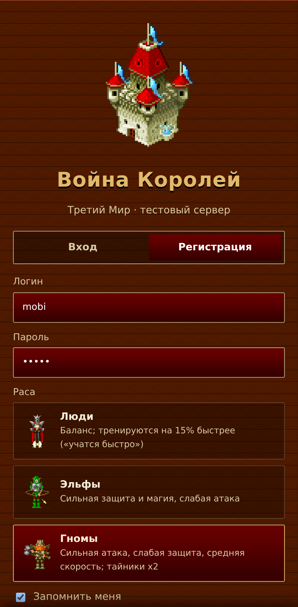
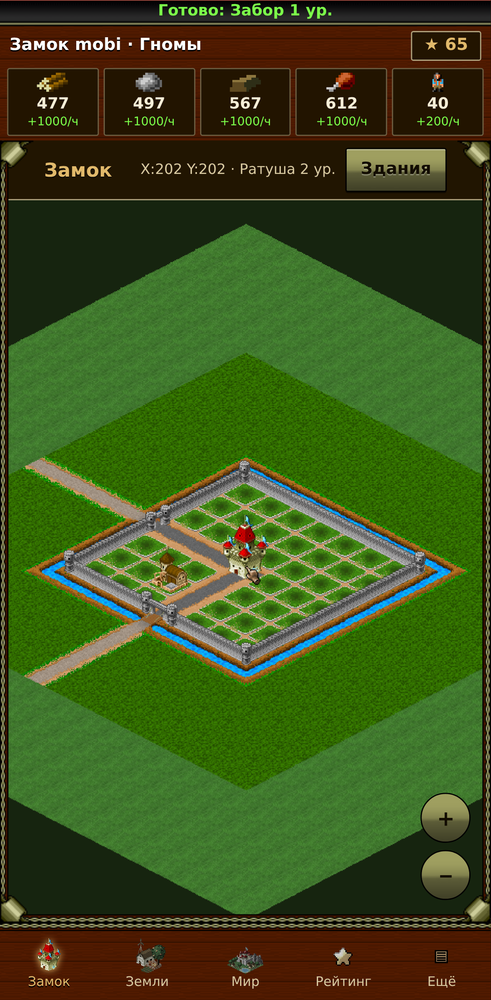
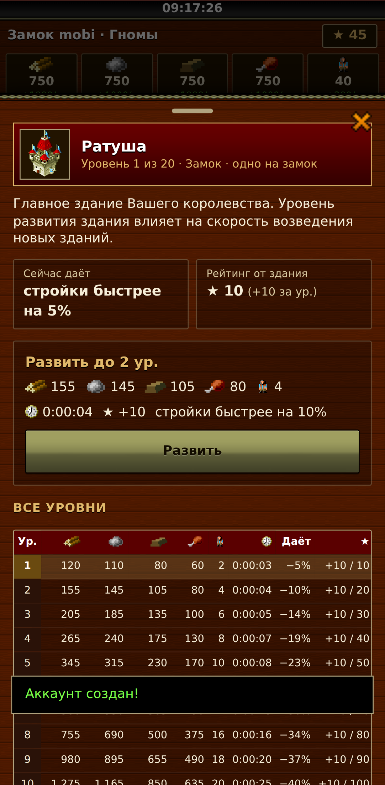
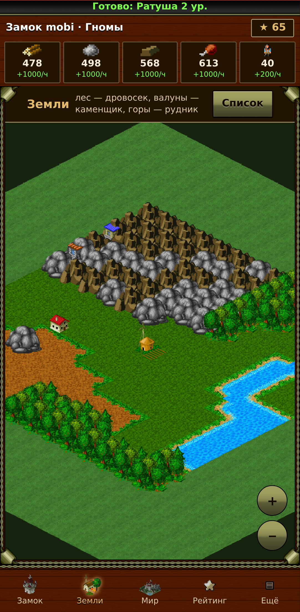
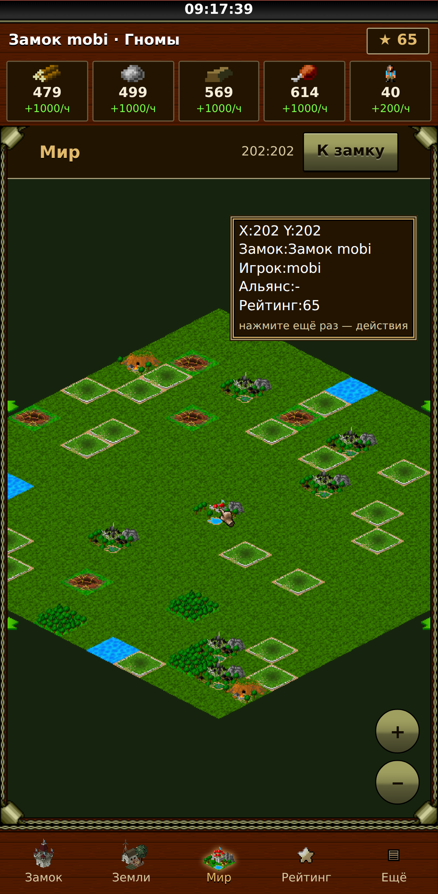

# 05. Локальный тест: сервер в Termux + оригинальный клиент

Цель — запустить наш тестовый сервер на телефоне (Termux) и подключить к нему **оригинальный J2ME-клиент**
«Третий Мир» (`Third_World_War_of_Kings_2D.jar`) через J2ME Loader. Всё работает без интернета.

```
┌──────────────── телефон ────────────────┐
│  J2ME Loader: tw_local.jar ──TCP──┐      │
│                        127.0.0.1:2500    │
│  Termux: node server/src/index.js ◄┘     │
└──────────────────────────────────────────┘
```

## 0. Браузерная игра для Android (главный клиент)

Сервер сам отдаёт игру в браузер телефона — ставить ничего не нужно.

```bash
cd ~ && rm -rf vs && unzip -q ~/storage/downloads/vs-*.zip && mv vs-* vs   # код из «Загрузок»
cd ~/vs/server && npm start
```

Откройте в Chrome на телефоне **http://localhost:8080**. Меню Chrome → «Добавить на главный экран» запускает игру
как приложение, во весь экран. Графика — оригинальная, из клиента «Третий Мир» (`web/gfx`).

| Экран | Что там |
|---|---|
| Вход / регистрация | логин, пароль, раса (Люди, Эльфы, Гномы) |
| Замок | изометрическая карта 7×7: палец — двигать, щипок — масштаб, нажатие на клетку — здание |
| Здание (шторка снизу) | уровень, что даёт, рейтинг, цена и время следующего уровня, **таблица всех уровней** (ресурсы, время, добыча, рейтинг) |
| Земли | 15×15: лес — Дровосек, валуны — Каменьщик, горы — Рудник, трава — Огород/Хибара, вода — Рыболовная заводь |
| Мир | замки игроков и объекты карты, профиль, письмо владельцу |
| Рейтинг | таблица игроков; ★ = уровни зданий замка ×10 + уровни на землях ×5 |
| Ещё | профиль, почта, справочник зданий, войска рас, формулы, сообщение об ошибке, выход |

Отрисовка повторяет оригинальный J2ME-клиент (декомпиляция класса `s`): земля и поле `grass1` на 5 клеток вокруг,
ров `rov0–7` вокруг квадрата застройки, стена `fence0–4` — когда построен Забор, курсор-рука на выбранной клетке,
стройка — столбик из 10 зелёных квадратиков; в мире — стрелки перехода по краям и инфо-окно клетки
(X/Y, замок, игрок, альянс, рейтинг). Интерфейс — дерево, цепи и уголки, полоса с часами и сообщениями, как в клиенте.

| Регистрация | Замок со стеной | Здание | Земли | Мир |
|---|---|---|---|---|
|  |  |  |  |  |

## 1. Termux

1. Установите **Termux из F-Droid** (версия из Google Play устарела и не обновляет пакеты).
2. В Termux:
   ```bash
   pkg update && pkg upgrade
   pkg install nodejs-lts git python
   termux-setup-storage          # доступ к «Загрузкам» телефона: ~/storage/downloads
   ```
3. Получите код проекта (репозиторий приватный — нужен токен GitHub, либо скопируйте папку через USB):
   ```bash
   git clone https://github.com/Darkdini/vs.git
   cd vs
   git checkout claude/third-world-kings-war-analysis-lodxja
   ```

## 2. Сервер

```bash
cd ~/vs/server
npm test          # смоук-тест протокола: должен закончиться «ВСЕ ПРОВЕРКИ ПРОЙДЕНЫ»
npm start         # слушает 0.0.0.0:2500
```

Переменные окружения:

| Переменная | По умолчанию | Смысл |
|---|---|---|
| `PORT` | 2500 | порт (как в оригинальном клиенте) |
| `HOST` | 0.0.0.0 | интерфейс |
| `SPEED` | 10 | скорость мира (время строек делится, добыча умножается) |
| `MAX_QUEUE` | 3 | одновременных строек |
| `DB` | `server/data/db.json` | файл с аккаунтами и замками |
| `DEBUG` | 0 | `1` — hex-дамп каждого пакета в консоль |
| `TZ_LABEL` | GMT+03:00 | часовой пояс для часов в клиенте |

Пример: `SPEED=100 DEBUG=1 npm start`.

Чтобы Android не усыплял сервер: `termux-wake-lock` (снять — `termux-wake-unlock`).
Запуск в фоне: `nohup npm start > server.log 2>&1 &`, остановка — `pkill -f src/index.js`.
Сброс мира: остановить сервер и удалить `server/data/db.json`.

## 3. Клиент

1. Положите оригинальный `Third_World_War_of_Kings_2D.jar` в «Загрузки».
2. Перенастройте его на наш сервер:
   ```bash
   cd ~/vs
   python tools/patch_client.py ~/storage/downloads/Third_World_War_of_Kings_2D.jar \
       ~/storage/downloads/tw_local.jar --host 127.0.0.1
   ```
   Скрипт меняет только адрес сервера (`mmog1.com` → ваш хост; можно `--port`) и убирает пустую строку в манифесте.
3. Установите **J2ME Loader** (F-Droid или Google Play), откройте `tw_local.jar`.
   В настройках приложения: разрешение **240×320**, экранная клавиатура — включена.
4. В игре: **Регистрация** → заполнить имя/пароль/расу, поставить «Принимаю» → **Продолжить** →
   войти созданным логином.

### Сервер на другом устройстве
Запустите сервер на ПК/другом телефоне в той же Wi-Fi-сети, узнайте его IP (`ip addr` / `ifconfig`) и пропатчите
клиент на него: `--host 192.168.1.10`. Порт 2500 должен быть открыт.

## 4. Что уже работает (проверено на настоящем клиенте)

| Функция | Как проверить |
|---|---|
| Подключение, проверка версии, баннер формы входа (картинка с сервера) | запуск клиента |
| Регистрация (3 расы), вход, неверный пароль | формы клиента |
| Карта **Замка** 7×7 с Ратушей и Складом, часы, бегущая строка | после входа |
| Постройка/улучшение здания: список с ценами и временем → полоска прогресса → «Готово» | курсор на пустую клетку/здание, `5` |
| **Земли** 15×15 с рельефом клиента: на лесе — Дровосек, валунах — Каменьщик, горах — Рудник, траве — Огород/Хибара, воде — Рыболовная заводь | `*` |
| **Мир**: окно 7×7 с замками игроков и объектами, прокрутка | `*` ещё раз |
| Ресурсы: запасы, добыча, вместимость (растут в реальном времени) | `#` |
| Меню: Кабинет (профиль), Рейтинг, Справка, Bug! (сохраняется на сервере) | правая софт-клавиша |
| Почта между игроками: написать, входящие/исходящие, прочитать | меню → Почта, или «Сообщение» в окне чужого замка |

Не реализовано (сервер ответит «пока не реализовано»): войска и бой, торговля и рынок, альянсы, бонусы,
экспедиции/артефакты, основание новых замков.

## 5. Если что-то не так

| Симптом | Причина / решение |
|---|---|
| «Невозможно установить соединение с сервером» | сервер не запущен, или jar пропатчен на другой адрес; проверьте `npm start` и `--host` |
| В консоли сервера ничего не появляется при запуске клиента | клиент подключается не туда — перепатчите jar; для другого устройства — проверьте Wi-Fi и IP |
| После входа «часики» и ничего не происходит | запустите сервер с `DEBUG=1` и пришлите лог — видно, какой пакет не понравился клиенту |
| Баннер наезжает на поля при первом запуске | клиент раскладывает форму до прихода картинки; при следующем запуске всё ровно |
| Хочу начать заново | удалить `server/data/db.json`; в J2ME Loader — «Очистить данные» у игры (сбросит сохранённый логин) |

## 6. Автотест настоящего клиента на ПК (без телефона)

`tools/client-harness/run.sh` скачивает эмулятор freej2me (фиксированная версия), добавляет в него настоящие
TCP-сокеты и прогоняет клиента по сценарию, сохраняя скриншоты:

```bash
cd server && SPEED=200 npm start &                     # сервер на 2500
python3 tools/patch_client.py client.jar /tmp/tw.jar --host 127.0.0.1
tools/client-harness/run.sh /tmp/tw.jar tools/client-harness/scenarios/register-login-build.txt shots/
```

Сценарий `register-login-build.txt`: регистрация → вход → стройка Склада → Земли → Мир → меню → Кабинет
(12 скриншотов). Команды сценария: `wait`, `key`, `select <строка> <столбец>`, `text`, `shot`, `dump` (печатает
структуру текущего окна), `state` (состояние клавиш клиента). Нужны git и JDK 11+.

## 7. Android 3D-клиент (Third_World_War_of_Kings_3D 2.0.112)

Сервер уже слушает порт **5005** (переменная `PORT3D`). Клиент перенастраивается и переподписывается так:

```bash
pkg install python python-cryptography
python tools/repack_apk.py ~/storage/downloads/Third_World_War_of_Kings_3D_2_0_112.apk \
    ~/storage/downloads/tw3d_local.apk --host 127.0.0.1
```

1. **Удалите оригинальную игру** с телефона (подписи разные, поверх не встанет).
2. Установите `tw3d_local.apk` из «Загрузок» (разрешите установку из неизвестных источников).
3. Запустите сервер в Termux (`npm start`), затем игру.
4. Появится окно «Война Королей / Тестовый сервер» → **Регистрация** → логин, пароль, раса → окно замка.

Ключ подписи хранится в `~/.tw-repack/` — не удаляйте его, иначе следующие сборки не встанут поверх.
Если что-то пошло не так — запустите сервер с `DEBUG=1 npm start` и пришлите вывод: в нём видно
каждую команду клиента (`<< USER.START …`) и байты пакетов.
